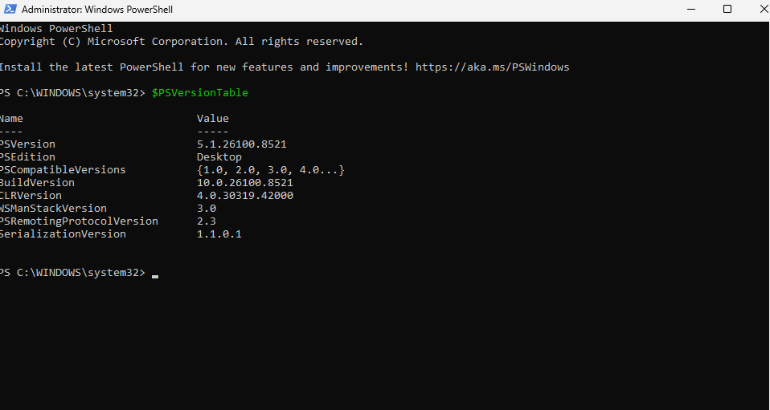
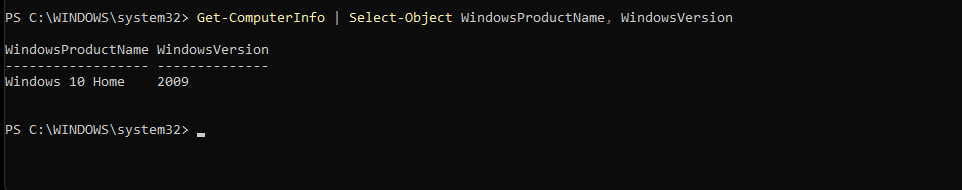
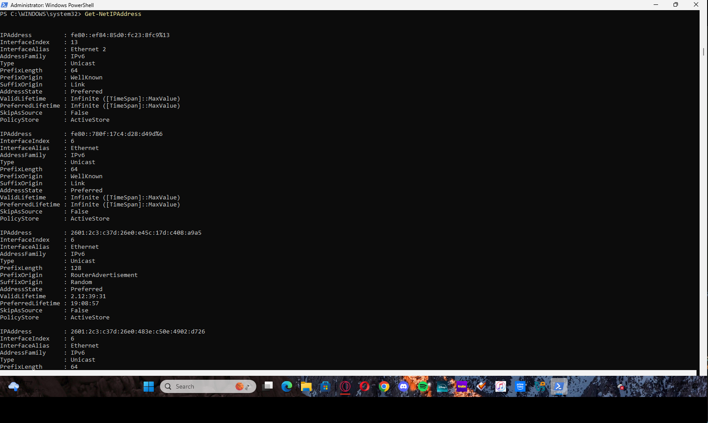
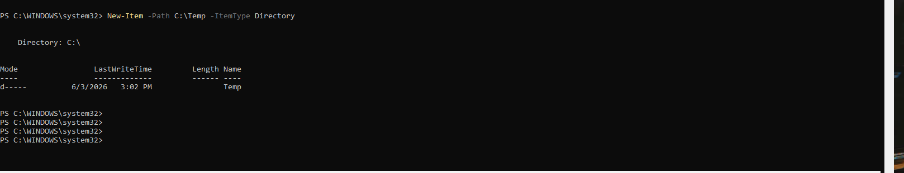
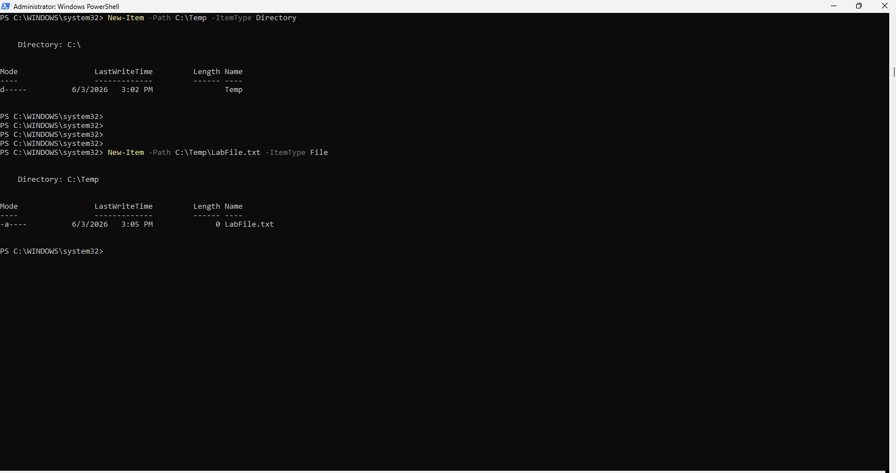
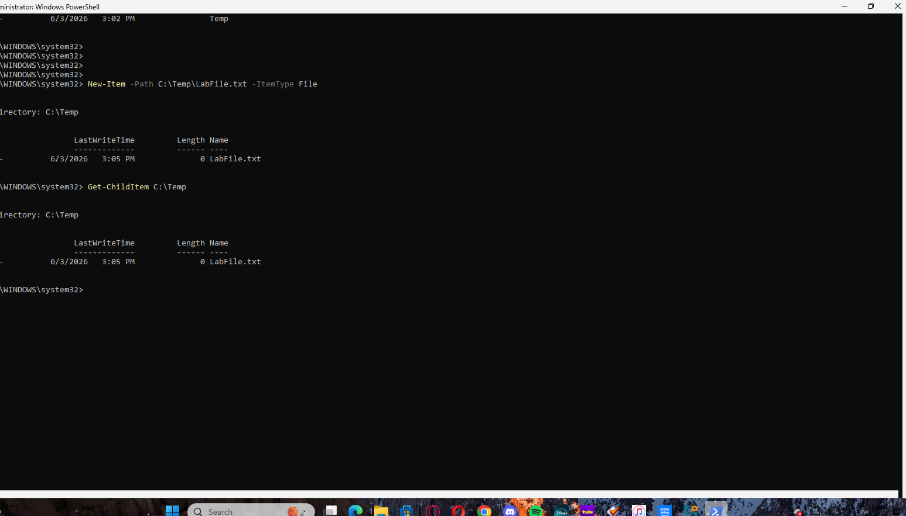
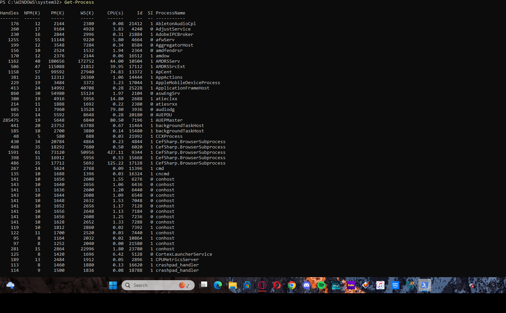
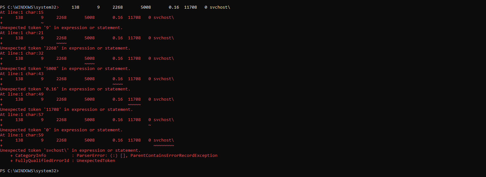

# PowerShell Administration Lab

## Project Overview

This lab demonstrates fundamental Windows administration tasks using PowerShell. The project focuses on gathering system information, managing files and folders, viewing network configurations, and monitoring system processes through command-line administration.

The objective was to develop familiarity with PowerShell commands commonly used in Help Desk, Desktop Support, and System Administration environments.

---

## Technologies Used

* Windows 10
* Windows PowerShell 5.1
* Command-Line Administration
* Windows Networking Tools

---

## Lab Objectives

* Verify PowerShell installation and version
* Gather operating system information
* View network configuration details
* Create directories using PowerShell
* Create files using PowerShell
* Verify file creation
* Monitor running processes
* View active system services

---

## Environment Verification

### PowerShell Version

Verified the installed PowerShell version.

```powershell
$PSVersionTable
```



---

### System Information

Retrieved operating system details.

```powershell
Get-ComputerInfo | Select-Object WindowsProductName, WindowsVersion
```



---

## Network Administration

### View IP Address Configuration

Displayed IPv4 and IPv6 network information.

```powershell
Get-NetIPAddress
```



---

## File and Folder Management

### Create Directory

Created a new folder using PowerShell.

```powershell
New-Item -Path C:\Temp -ItemType Directory
```



---

### Create File

Created a test file inside the newly created directory.

```powershell
New-Item -Path C:\Temp\LabFile.txt -ItemType File
```



---

### Verify File Creation

Confirmed the file was successfully created.

```powershell
Get-ChildItem C:\Temp
```



---

## Process Management

### View Running Processes

Displayed active system processes.

```powershell
Get-Process
```



---

## Service Management

### View Running Services

Displayed installed services and their status.

```powershell
Get-Service
```



---

## Skills Demonstrated

* Windows PowerShell Administration
* Command-Line Operations
* System Information Gathering
* Network Configuration Review
* Process Monitoring
* Service Management
* File and Folder Administration
* Windows Troubleshooting Fundamentals

---

## Key Commands Used

```powershell
$PSVersionTable

Get-ComputerInfo

Get-NetIPAddress

New-Item -Path C:\Temp -ItemType Directory

New-Item -Path C:\Temp\LabFile.txt -ItemType File

Get-ChildItem C:\Temp

Get-Process

Get-Service
```

---

## Results

Successfully completed a series of administrative tasks using PowerShell, including system information gathering, network inspection, file management, process monitoring, and service administration.

This project demonstrates foundational command-line skills used daily by IT Support Specialists, Help Desk Technicians, and Junior System Administrators.

---

## Author

**Dante Walker**

Aspiring IT Support / Help Desk Professional

GitHub Portfolio Project
